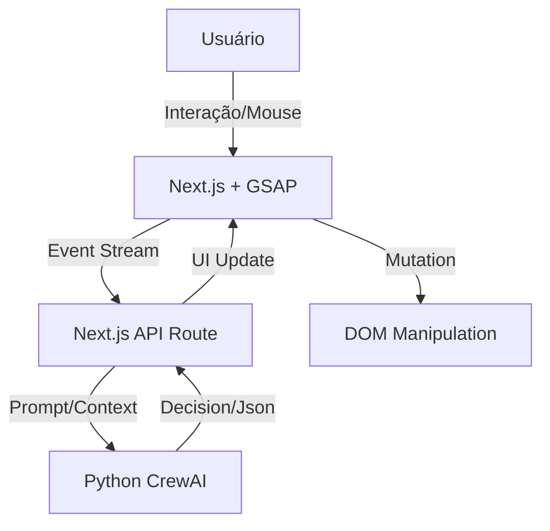

# Mad Lab Aurora: Cookbook de Implementação 🍳

## Arquitetura Híbrida: Sedução Visual (Frontend) + Cognição (Backend)

Este documento detalha como conectar o **Cérebro (Cortex/CrewAI)** ao **Corpo (Next.js/React)**.

### 1. O Fluxo de Dados



### 2. Padrões de Implementação

#### A. O "Sensor Neural" (Client-Side)
Captura micro-interações para o Agente Empath.

```typescript
// hooks/useNeuroSensor.ts
import { useEffect } from 'react';

export const useNeuroSensor = (onSignal: (data: any) => void) => {
  useEffect(() => {
    const handleMouseMove = (e: MouseEvent) => {
        // Detecta velocidade, hesitação (hover longo), tremores
        // Envia para o Cortex se cruzar limiares significativos
    };
    window.addEventListener('mousemove', handleMouseMove);
    return () => window.removeEventListener('mousemove', handleMouseMove);
  }, []);
};
```

#### B. O "Executor de Mutações" (GSAP)
Recebe ordens do Agente Atmosfera e altera o DOM.

```typescript
// components/AtmosphereController.tsx
const updateMood = (mood: 'ANXIOUS' | 'CALM' | 'EXCITED') => {
    if (mood === 'CALM') {
        gsap.to('.hero-bg', { filter: 'blur(20px)', duration: 2 });
        gsap.to('.typography', { letterSpacing: '0.05em', duration: 1 });
    }
    // ...
}
```

### 3. Integração com Vercel AI SDK
Para UI Generativa (Agente Visualizer).

*   Uso de `useObject` para streaming de componentes JSON estruturados.
*   Renderização dinâmica com `React.lazy` ou mapeamento de componentes do Design System.
